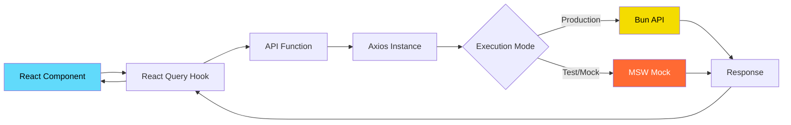
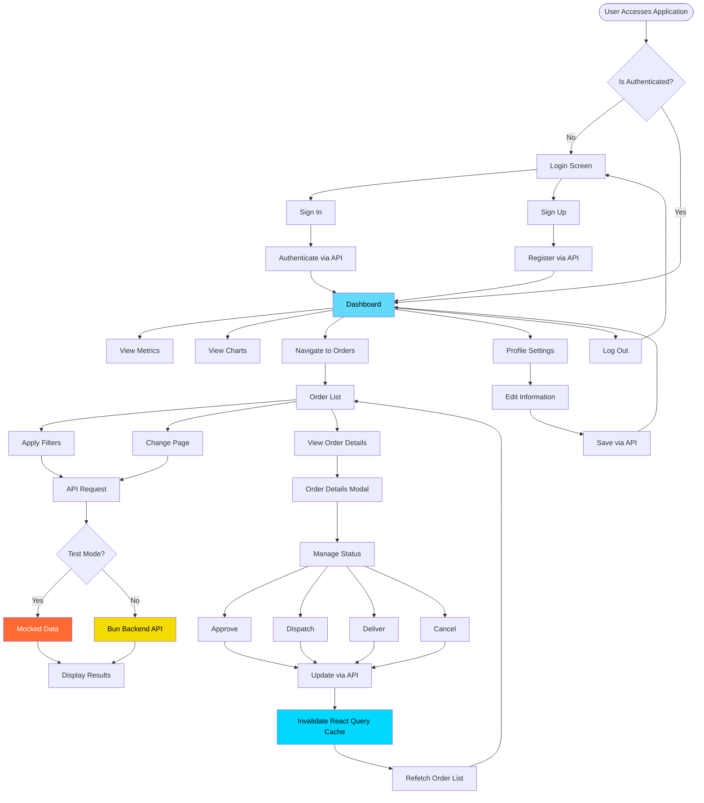

<div align="center">
  <h1>🍕 Pizza Shop Frontend</h1>
  <p>Order management system and dashboard for pizzerias</p>
  
  [](https://react.dev/)
  [](https://www.typescriptlang.org/)
  [](https://vite.dev/)
  [](https://tailwindcss.com/)
</div>

---

## 📋 About the Project

The **Pizza Shop Frontend** is a modern web application designed for order management and metric visualization tailored for pizzerias. The system features a comprehensive dashboard with interactive charts, an order listing interface with advanced filtering, secure user authentication, and establishment profile management.

The application adheres to high development standards, featuring comprehensive unit and end-to-end (E2E) testing, API mocking for local development, and seamless integration with a performant Bun-based backend.

> [!WARNING]
> **Backend Dependency:** This frontend application requires its companion backend to function fully in production mode. The backend repository is available at [pizza-shop-backend](https://github.com/patrick-cuppi/pizza-shop-backend).

---

## ✨ Features

- 🔐 **Authentication**: Secure login system and restaurant registration.
- 📊 **Dashboard**: Real-time metric visualization.
  - Daily orders
  - Monthly orders
  - Canceled orders
  - Monthly revenue
  - Weekly revenue chart
  - Most popular products
- 📦 **Order Management**
  - Paginated order listing
  - Advanced filtering by ID, customer name, and status
  - Comprehensive order details
  - Status progression tracking (Approve, Dispatch, Deliver, Cancel)
- 👤 **Profile**: Establishment information and settings management.
- 🌓 **Theming**: Seamless toggle between Light and Dark modes.
- 📱 **Responsive Design**: Interface fully adapted for various devices and screen sizes.

---

## 🛠️ Tech Stack

### Core

- **[React 18.2](https://react.dev/)** - UI library for building component-driven interfaces.
- **[TypeScript 5.2](https://www.typescriptlang.org/)** - Strongly typed JavaScript superset.
- **[Vite 5.0](https://vitejs.dev/)** - Next-generation frontend tooling and ultra-fast dev server.

### Routing & State Management

- **[React Router DOM 6.30](https://reactrouter.com/)** - Declarative routing for React applications.
- **[TanStack Query 5.90](https://tanstack.com/query)** - Powerful asynchronous state management and data fetching.

### UI & Styling

- **[Tailwind CSS 3.3](https://tailwindcss.com/)** - Utility-first CSS framework for rapid UI development.
- **[Radix UI](https://www.radix-ui.com/)** - Unstyled, accessible UI primitives.
- **[Lucide React](https://lucide.dev/)** - Beautiful and consistent icon toolkit.
- **[Recharts 3.6](https://recharts.org/)** - Composable charting library built on React components.
- **[Sonner](https://sonner.emilkowal.ski/)** - An opinionated toast component for React.

### Forms & Validation

- **[React Hook Form 7.68](https://react-hook-form.com/)** - Performant, flexible, and extensible form handling.
- **[Zod 4.1](https://zod.dev/)** - TypeScript-first schema validation with static type inference.

### HTTP Client & Mocking

- **[Axios 1.13](https://axios-http.com/)** - Promise-based HTTP client.
- **[MSW 2.12](https://mswjs.io/)** - Mock Service Worker for API mocking during testing and local development.

### Testing

- **[Vitest 4.0](https://vitest.dev/)** - Blazing fast unit test framework powered by Vite.
- **[Playwright 1.58](https://playwright.dev/)** - Framework for reliable end-to-end testing.
- **[Testing Library](https://testing-library.com/)** - Simple and complete testing utilities that encourage good testing practices.

---

## 📊 Architecture & API Integration

### Communication Structure

The application consumes a RESTful API built with **Bun** (a fast, modern JavaScript runtime). Network requests are handled by Axios with centralized configurations:

```typescript
// src/lib/axios.ts
import { env } from "@/env";
import axios from "axios";

export const api = axios.create({
  baseURL: env.VITE_API_URL,
  withCredentials: true, // Enable cookie support for authentication
});
```

### Request Flow Architecture



### Application Layers

1. **Presentation Layer** (`/src/pages`): React components responsible for rendering the UI.
2. **Data Layer** (`/src/api`): Functions that encapsulate HTTP calls.
3. **Cache Layer** (`React Query`): State management, caching, and background synchronization.
4. **Mock Layer** (`/src/api/mocks`): Request interception for testing and isolated development environments.

### Data Fetching Example

```typescript
// 1. API function definition
export async function getOrders({ pageIndex, orderId, customerName, status }: GetOrdersQuery) {
  const response = await api.get<GetOrdersResponse>("/orders", {
    params: { pageIndex, orderId, customerName, status }
  });
  return response.data;
}

// 2. React Query hook inside a component
const { data: result } = useQuery({
  queryKey: ['orders', filters],
  queryFn: () => getOrders(filters),
});

// 3. MSW intercepts and returns a mock response during tests
http.get('/orders', () => {
  return HttpResponse.json(mockOrdersData)
})
```

### Environment Variables

```env
VITE_API_URL=http://localhost:3333
VITE_ENABLE_API_DELAY=true
```

---

## 🧪 Testing Strategy

The application features a comprehensive test suite covering components, pages, and critical user flows.

### Unit Tests (Vitest + Testing Library)

**Run tests:**
```bash
pnpm dev:test
```

**View coverage report:**
```bash
pnpm coverage
```

**Tested Components:**
- `nav-link.spec.tsx` - Navigation link active state logic
- `order-status.spec.tsx` - Order status badge rendering
- `pagination.spec.tsx` - Pagination component controls

**Unit Test Example:**
```typescript
test('should highlight the nav link when it is the current page', () => {
  render(
    <NavLink to="/orders">Orders</NavLink>,
    { wrapper: MemoryRouter, initialEntries: ['/orders'] }
  )
  
  expect(screen.getByText('Orders').dataset.current).toEqual('true')
})
```

### End-to-End Tests (Playwright)

**Run E2E tests:**
```bash
pnpm playwright test --ui
```

**Test Suites:**

1. **Dashboard** (`dashboard.e2e-spec.ts`)
   - Validates daily/monthly metric displays.
   - Validates canceled orders metric.
   - Validates monthly revenue displays.

2. **Orders** (`orders.e2e-spec.ts`)
   - Order listing and pagination.
   - Filtering by Order ID, Customer Name, and Status.

3. **Authentication** (`sign-in.e2e-spec.ts` & `sign-up.e2e-spec.ts`)
   - User login flow.
   - Restaurant registration.
   - Form validation behavior.

4. **Profile** (`store-profile.e2e-spec.ts`)
   - Updating establishment details.

### Mock Service Worker (MSW)

For tests and local development without a backend, the application utilizes MSW to intercept HTTP requests and return mocked responses:

- ✅ Isolated testing environment.
- ✅ Backend-independent development capabilities.
- ✅ Consistent, reliable data for E2E testing.
- ✅ 17 fully mocked endpoints.

---

## 🎨 User Interface

The interface was designed with a strong focus on usability and accessibility:

- **Design System**: Radix UI components ensure WCAG compliance and keyboard accessibility.
- **Responsiveness**: Fluid, adaptive layouts built with Tailwind CSS.
- **Theming**: Native support for Light and Dark modes with `localStorage` persistence.
- **Visual Feedback**: Graceful toast notifications, loading states, and smooth micro-animations.
- **Interactive Charts**: Responsive data visualization powered by Recharts.

### Main Routes

| Page | Description | Route |
|------|-------------|-------|
| **Dashboard** | Key metrics and interactive charts | `/` |
| **Orders** | Order listing and management interface | `/orders` |
| **Sign In** | User authentication | `/sign-in` |
| **Sign Up** | New restaurant registration | `/sign-up` |

---

## 🚀 Getting Started

### Prerequisites

Ensure you have the following installed:
- [Node.js](https://nodejs.org/) 18+
- [pnpm](https://pnpm.io/) (Recommended) or npm
- **[Pizza Shop Backend](https://github.com/patrick-cuppi/pizza-shop-backend)** running on port `3333` (Required for production mode).

### Installation

```bash
# Clone the repository
git clone https://github.com/patrick-cuppi/pizza-shop-frontend

# Navigate to the project directory
cd pizza-shop-frontend

# Install dependencies
pnpm install
```

### Configuration

Create a `.env` file in the project root:

```env
VITE_API_URL=http://localhost:3333
VITE_ENABLE_API_DELAY=true
```

> **Note:** For running tests or completely mocked environments, set `VITE_ENABLE_API_DELAY=false`.

### Running the Development Server

```bash
# Standard development mode (requires the Bun backend)
pnpm dev

# Mocked development mode (runs on port 5001, no backend required)
pnpm dev:test
```

### Building for Production

```bash
# Type-check and build the application
pnpm build

# Preview the production build locally
pnpm preview
```

---

## 📁 Project Structure

```text
pizza-shop-frontend/
├── src/
│   ├── api/              # API communication functions
│   │   └── mocks/        # MSW mocks for testing
│   ├── components/       # Reusable UI components
│   │   ├── theme/        # Theme management logic
│   │   └── ui/           # Base UI primitives
│   ├── lib/              # Library configurations (Axios, React Query, etc.)
│   ├── pages/            # Application views/pages
│   │   ├── _layouts/     # Shared route layouts
│   │   ├── app/          # Authenticated pages
│   │   └── auth/         # Authentication pages
│   ├── app.tsx           # Root component
│   ├── routes.tsx        # Routing configuration
│   └── env.ts            # Environment variable schema validation
├── test/                 # E2E test suites (Playwright)
├── public/               # Static public assets
└── playwright.config.ts  # Playwright configuration
```

---

## 🔄 Application Flow Diagram



---

## 🤝 Contributing

Contributions are highly appreciated! Feel free to submit issues and pull requests.

1. Fork the repository
2. Create a feature branch (`git checkout -b feature/AmazingFeature`)
3. Commit your changes (`git commit -m 'Add some AmazingFeature'`)
4. Push to the branch (`git push origin feature/AmazingFeature`)
5. Open a Pull Request

---

## 📝 License

This project is licensed under the MIT License. See the [LICENSE](https://github.com/patrick-cuppi/pizza-shop-frontend/blob/main/LICENSE) file for more details.

---

<div align="center">
  <p>Built with React, TypeScript, and Bun 🚀</p>
</div>
