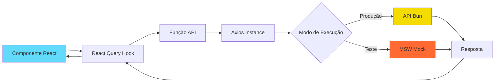
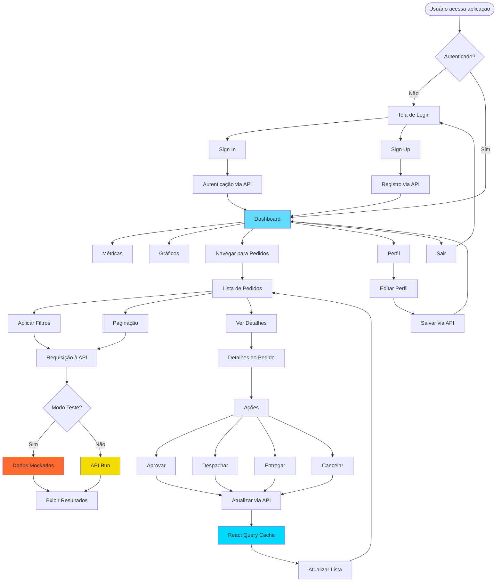

<div align="center">
  <h1>🍕 Pizza Shop Frontend</h1>
  <p>Sistema de gerenciamento de pedidos e dashboard para pizzarias</p>
  
  [](https://react.dev/)
  [](https://www.typescriptlang.org/)
  [](https://vite.dev/)
  [](https://tailwindcss.com/)
</div>

---

## 📋 Sobre o Projeto

O **Pizza Shop Frontend** é uma aplicação web moderna desenvolvida para gerenciamento de pedidos e visualização de métricas de uma pizzaria. O sistema oferece um dashboard completo com gráficos interativos, listagem de pedidos com filtros avançados, autenticação de usuários e perfil de estabelecimento.

A aplicação foi desenvolvida incluindo testes unitários e E2E, mock de APIs para desenvolvimento e integração com backend em Bun.

O back-end do projeto está disponível [clicando aqui](https://github.com/patrick-cuppi/pizza-shop-backend).

---

## ✨ Funcionalidades

- 🔐 **Autenticação**: Sistema de login e cadastro de restaurantes
- 📊 **Dashboard**: Visualização de métricas em tempo real
  - Pedidos do dia
  - Pedidos do mês
  - Pedidos cancelados
  - Receita mensal
  - Gráfico de receita semanal
  - Produtos mais populares
- 📦 **Gerenciamento de Pedidos**
  - Listagem paginada de pedidos
  - Filtros por ID, cliente e status
  - Detalhes completos do pedido
  - Atualização de status (aprovar, despachar, entregar, cancelar)
- 👤 **Perfil**: Edição de informações do estabelecimento
- 🌓 **Tema**: Alternância entre modo claro e escuro
- 📱 **Responsivo**: Interface adaptada para diferentes dispositivos

---

## 🛠️ Tecnologias Utilizadas

### Core

- **[React 18.2](https://react.dev/)** - Biblioteca para construção de interfaces
- **[TypeScript 5.2](https://www.typescriptlang.org/)** - Superset JavaScript com tipagem estática
- **[Vite 5.0](https://vitejs.dev/)** - Build tool e dev server ultrarrápido

### Roteamento e Estado

- **[React Router DOM 6.30](https://reactrouter.com/)** - Roteamento declarativo
- **[TanStack Query 5.90](https://tanstack.com/query)** - Gerenciamento de estado assíncrono

### UI e Estilização

- **[Tailwind CSS 3.3](https://tailwindcss.com/)** - Framework CSS utility-first
- **[Radix UI](https://www.radix-ui.com/)** - Componentes acessíveis e não-estilizados
- **[Lucide React](https://lucide.dev/)** - Ícones modernos e customizáveis
- **[Recharts 3.6](https://recharts.org/)** - Biblioteca de gráficos para React
- **[Sonner](https://sonner.emilkowal.ski/)** - Toast notifications elegantes

### Formulários e Validação

- **[React Hook Form 7.68](https://react-hook-form.com/)** - Gerenciamento de formulários performático
- **[Zod 4.1](https://zod.dev/)** - Schema validation TypeScript-first

### Requisições HTTP

- **[Axios 1.13](https://axios-http.com/)** - Cliente HTTP baseado em promises
- **[MSW 2.12](https://mswjs.io/)** - Mock Service Worker para testes e desenvolvimento

### Testes

- **[Vitest 4.0](https://vitest.dev/)** - Framework de testes unitários ultrarrápido
- **[Playwright 1.58](https://playwright.dev/)** - Framework para testes E2E
- **[Testing Library](https://testing-library.com/)** - Utilities para testes de componentes React

---

## 📊 Arquitetura e Consumo de API

### Estrutura de Comunicação com API

A aplicação consome uma API REST desenvolvida em **Bun** (runtime JavaScript moderno e performático). A comunicação é estabelecida através do Axios com configurações centralizadas:

```typescript
// src/lib/axios.ts
import { env } from "@/env";
import axios from "axios";

export const api = axios.create({
  baseURL: env.VITE_API_URL,
  withCredentials: true, // Suporte a cookies para autenticação
});
```

### Fluxo de Comunicação



### Camadas da Aplicação

1. **Camada de Apresentação** (`/src/pages`): Componentes React que renderizam a UI
2. **Camada de Dados** (`/src/api`): Funções que encapsulam chamadas HTTP
3. **Camada de Cache** (`React Query`): Gerenciamento de cache e sincronização
4. **Camada de Mock** (`/src/api/mocks`): Interceptação de requests em ambiente de teste

### Exemplo de Fluxo de Requisição

```typescript
// 1. Definição da função de API
export async function getOrders({ pageIndex, orderId, customerName, status }: GetOrdersQuery) {
  const response = await api.get<GetOrdersResponse>("/orders", {
    params: { pageIndex, orderId, customerName, status }
  });
  return response.data;
}

// 2. Hook React Query no componente
const { data: result } = useQuery({
  queryKey: ['orders', filters],
  queryFn: () => getOrders(filters),
});

// 3. Em modo teste, MSW intercepta e retorna mock
http.get('/orders', () => {
  return HttpResponse.json(mockOrdersData)
})
```

### Variáveis de Ambiente

```env
VITE_API_URL=http://localhost:3333
VITE_ENABLE_API_DELAY=true
```

---

## 🧪 Testes

A aplicação possui uma suíte completa de testes cobrindo componentes, páginas e fluxos de usuário.

### Testes Unitários (Vitest + Testing Library)

**Executar testes:**
```bash
pnpm dev:test
```

**Cobertura de código:**
```bash
pnpm coverage
```

**Componentes testados:**
- `nav-link.spec.tsx` - Links de navegação
- `order-status.spec.tsx` - Badge de status de pedidos
- `pagination.spec.tsx` - Componente de paginação

**Exemplo de teste unitário:**
```typescript
test('should highlight the nav link when is the current page', () => {
  render(
    <NavLink to="/orders">Orders</NavLink>,
    { wrapper: MemoryRouter, initialEntries: ['/orders'] }
  )
  
  expect(screen.getByText('Orders').dataset.current).toEqual('true')
})
```

### Testes E2E (Playwright)

**Executar testes E2E:**
```bash
pnpm playwright test --ui
```

**Suítes de teste:**

1. **Dashboard** (`dashboard.e2e-spec.ts`)
   - Exibição de métricas do dia
   - Exibição de métricas do mês
   - Exibição de pedidos cancelados
   - Exibição de receita mensal

2. **Pedidos** (`orders.e2e-spec.ts`)
   - Listagem de pedidos
   - Paginação
   - Filtro por ID do pedido
   - Filtro por nome do cliente
   - Filtro por status

3. **Autenticação** (`sign-in.e2e-spec.ts` e `sign-up.e2e-spec.ts`)
   - Login de usuário
   - Cadastro de restaurante
   - Validação de formulários

4. **Perfil** (`store-profile.e2e-spec.ts`)
   - Atualização de informações do estabelecimento

### Mock Service Worker (MSW)

Para testes e desenvolvimento, a aplicação utiliza MSW para interceptar requisições HTTP e retornar dados mockados:

- ✅ Ambiente de teste isolado
- ✅ Desenvolvimento sem dependência do backend
- ✅ Dados consistentes para testes E2E
- ✅ 17 endpoints mockados

---

## 🎨 Interface

A interface foi desenvolvida com foco em usabilidade e acessibilidade, utilizando:

- **Design System**: Componentes do Radix UI garantem acessibilidade WCAG
- **Responsividade**: Layout adaptativo com Tailwind CSS
- **Tema**: Suporte a modo claro e escuro com persistência em localStorage
- **Feedback Visual**: Toasts, loading states e animações suaves
- **Gráficos Interativos**: Visualizações de dados com Recharts

### Páginas Principais

| Página | Descrição | Rota |
|--------|-----------|------|
| Dashboard | Métricas e gráficos da pizzaria | `/` |
| Pedidos | Listagem e gerenciamento de pedidos | `/orders` |
| Login | Autenticação de usuários | `/sign-in` |
| Cadastro | Registro de novo restaurante | `/sign-up` |

---

## 🚀 Como Executar

### Pré-requisitos

- Node.js 18+
- pnpm (recomendado) ou npm
- Backend em Bun rodando na porta 3333

### Instalação

```bash
# Clonar o repositório
git clone https://github.com/patrick-cuppi/pizza-shop-frontend

# Entrar no diretório
cd pizza-shop-frontend

# Instalar dependências
pnpm install
```

### Configuração

Crie um arquivo `.env` na raiz do projeto:

```env
VITE_API_URL=http://localhost:3333
VITE_ENABLE_API_DELAY=true
```
Para os testes, utilize: `VITE_ENABLE_API_DELAY=false` 

### Executar em Desenvolvimento

```bash
# Modo desenvolvimento normal
pnpm dev

# Modo desenvolvimento com mocks (porta 5001)
pnpm dev:test
```

### Build para Produção

```bash
# Compilar TypeScript e gerar build
pnpm build

# Preview do build de produção
pnpm preview
```

---

## 📁 Estrutura de Pastas

```
pizza-shop-frontend/
├── src/
│   ├── api/              # Funções de comunicação com API
│   │   └── mocks/        # Mocks MSW para testes
│   ├── components/       # Componentes reutilizáveis
│   │   ├── theme/        # Gerenciamento de tema
│   │   └── ui/           # Componentes da UI
│   ├── lib/              # Configurações de bibliotecas
│   ├── pages/            # Páginas da aplicação
│   │   ├── _layouts/     # Layouts compartilhados
│   │   ├── app/          # Páginas autenticadas
│   │   └── auth/         # Páginas de autenticação
│   ├── app.tsx           # Componente raiz
│   ├── routes.tsx        # Configuração de rotas
│   └── env.ts            # Validação de variáveis de ambiente
├── test/                 # Testes E2E (Playwright)
├── public/               # Arquivos estáticos
└── playwright.config.ts  # Configuração Playwright
```

---

## 🔄 Diagrama de Fluxo da Aplicação



---

## 🤝 Contribuindo

Contribuições são bem-vindas! Sinta-se à vontade para abrir issues e pull requests.

1. Fork o projeto
2. Crie uma branch para sua feature (`git checkout -b feature/MinhaFeature`)
3. Commit suas mudanças (`git commit -m 'Adiciona MinhaFeature'`)
4. Push para a branch (`git push origin feature/MinhaFeature`)
5. Abra um Pull Request

---

## 📝 Licença

Este projeto está sob a licença MIT. Veja o arquivo [LICENSE](https://github.com/patrick-cuppi/pizza-shop-frontend/blob/main/LICENSE) para mais detalhes.

---

<div align="center">
  <p>Feito com React, TypeScript e Bun 🚀</p>
</div>
